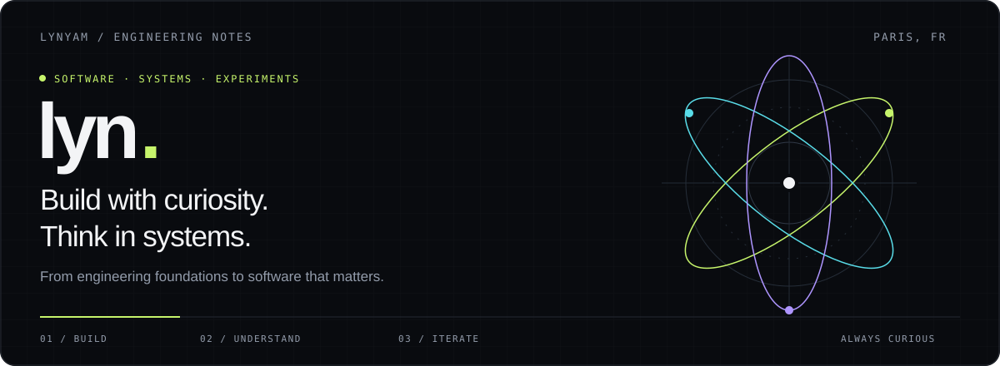
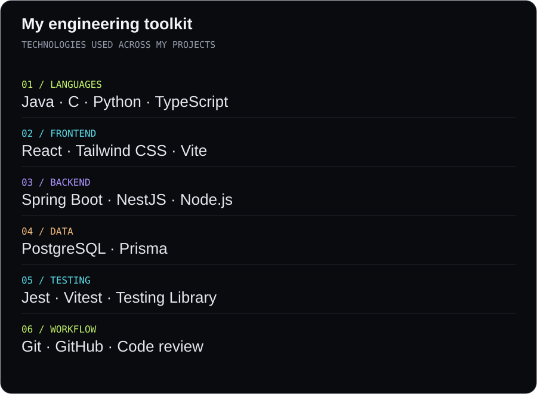
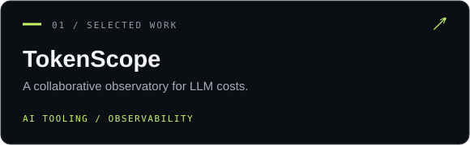
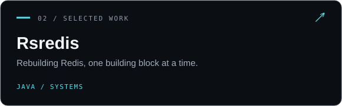
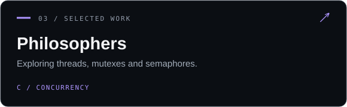
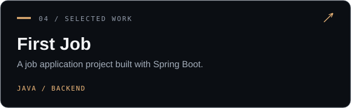

<a href="#my-toolkit">Toolkit</a> &nbsp; / &nbsp; <a href="#selected-work">Projects</a> &nbsp; / &nbsp; <a href="#what-im-exploring">Exploring</a>

### Engineering roots. Software mindset.

I'm **lyn**, based in **Paris**, with a degree in Technology and Engineering and a passion for software. I like understanding what happens beneath an abstraction: how a request travels, how data is stored, and how concurrent code behaves.

**Java is a central part of my work** — from Spring Boot applications to rebuilding Redis and practicing data structures and algorithms. I also build across the TypeScript stack and explore systems programming in C.

### My toolkit

<b>Inside the toolkit — how I use it</b>

| Area | Technologies | In practice |
| :--- | :--- | :--- |
| Languages | **Java**, C, Python, TypeScript | Applications, systems experiments and problem solving |
| Java backend | **Spring Boot** | Building a job application project with MVC architecture |
| Web interfaces | React, Tailwind CSS, Vite | TokenScope's frontend and application screens |
| APIs | NestJS, Node.js | Backend services, validation and authentication |
| Data | PostgreSQL, Prisma | Relational data, schemas and database access |
| Quality | Jest, Vitest, Testing Library | Backend and frontend tests |
| Collaboration | Git, GitHub, code review | Branches, pull requests and iterative development |

### Selected work

<b>Project notes — the ideas behind the code</b>

**[TokenScope](https://github.com/lynyam/tokenscope)** · Making LLM usage and estimated costs easier for engineering teams to understand. Built around a React and TypeScript frontend, a NestJS backend, and PostgreSQL with Prisma.

**[Rsredis](https://github.com/lynyam/Rsredis)** · Reimplementing Redis in **Java**, adding one building block at a time to understand the system beneath the interface.

**[First Job](https://github.com/lynyam/firstjobapp)** · Exploring application architecture through a **Java / Spring Boot** job app with an MVC foundation.

**[Philosophers](https://github.com/lynyam/multithreads_philosophers)** · A C project for going deeper into multithreading, mutual exclusion and semaphores.

**[Data structures & algorithms](https://github.com/lynyam/Problem_Solving_DSA)** · A growing record of problems solved in **Java**, focused on strengthening the fundamentals.

### What I'm exploring

**01 / Build** — Developing TokenScope and connecting product interfaces to backend services.  
**02 / Understand** — Backend architecture, database transactions, concurrency and authorization.  
**03 / Practice** — Data structures and algorithms in Java, with attention to reasoning and tradeoffs.

> Build something. Understand its internals. Make the next version better.

---

Paris · Engineering foundations, software curiosity. · **Build & think big.**
